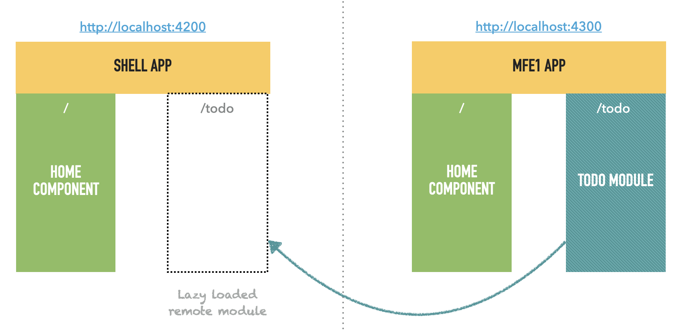
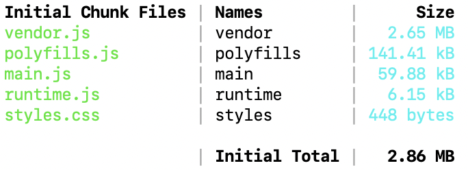
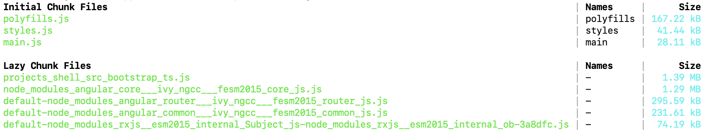
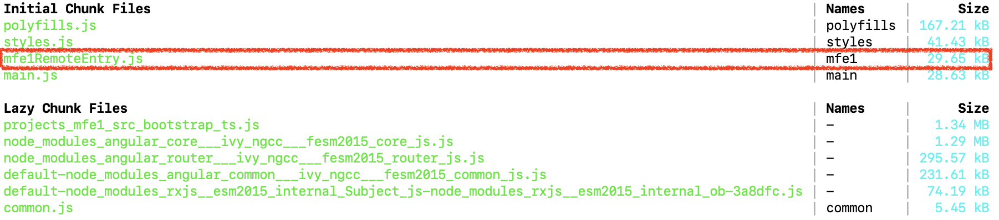
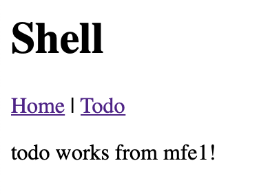

# Micro-frontends Basic Demo

This is a step-step basic demo to build a minimal micro-frontends architecture with two apps: a micro-app **mfe1** with a Todo module and a main **shell** app that loads the remote Todo module from **mfe1**.



It's mostly based on Manfred Steyer on Microfront and Module Federation series:
Article: https://www.angulararchitects.io/aktuelles/the-microfrontend-revolution-part-2-module-federation-with-angular/
Code: https://github.com/manfredsteyer/module-federation-plugin-example

## Create Angular Workspace

Create the workspace with Yarn as default package manager (required for Webpack 5 and Module Federation plugin).

```
ng new mfe-demo --createApplication="false" --packageManager yarn
cd mfe-demo
```

Create the two apps.

```
# Create shell app
ng generate application shell --routing --style=scss
# Create mfe1 app
ng generate application mfe1 --routing --style=scss
```

When running the shell app, you'll the default initial chunk files created by Webpack4.

```
ng serve shell
```



## Configure Webpack 5

Add AngularAchitects module federation, for shell and mfe1

```
ng add @angular-architects/module-federation --project shell --port 4200
```

```
CREATE projects/shell/webpack.config.js (1267 bytes)
CREATE projects/shell/webpack.prod.config.js (46 bytes)
CREATE projects/shell/src/bootstrap.ts (372 bytes)
UPDATE angular.json (8036 bytes)
UPDATE projects/shell/src/main.ts (58 bytes)
```

For the shell app, it will :
1. update package.json to add @angular-architects/module-federation dependency (which provides ngx-build-plus)
2. update angular.json to replace "@angular-devkit/build-angular:" to "ngx-build-plus:"
3. update angular.json to assign specified ports
4. generates default custom builder webpack.config.js
5. move main.ts content to bootstrap.ts and replace it with dynamic import `import('./bootstrap').catch(err => console.error(err));` to allow lazy loading of shared libraries like @angular/core, common or router (defined in webpack.config.js)

Then, again for mfe1 app:

```
ng add @angular-architects/module-federation --project mfe1 --port 4300
```

If your run the apps, you'll get:

```
An unhandled exception occurred: Cannot find module 'webpack/lib/container/ModuleFederationPlugin'
```

You'll need to for the CLI to use webpack 5 to be able to use module federation.

Add webpack resolutions property in package.json (e. g. before the dependencies section) and install dependencies

```json
  "private": true,
  "resolutions": {
    "webpack": "^5.4.0"
  },
```

```
yarn
```

When running again the shell app, you'll the default initial chunk files created by Webpack4.

```
ng serve shell
```




# Create home components

Create home component in shell and mfe1 app

```
ng generate component home --project=shell 
ng generate component home --project=mfe1  
```

Add routing config in both app-routing.module.ts

```typescript
const routes: Routes = [
  {
    path: '',
    component: HomeComponent,
    pathMatch: 'full',
  }
];
```

Replace default Shell and Mfe1 app.component.html

```html
<h1>Shell</h1>

<router-outlet></router-outlet>
```

```html
<h1>MFE1</h1>

<router-outlet></router-outlet>
```

Run shell and check http://localhost:4200/ 

```
ng serve shell
```

Run mfe1 and check http://localhost:4300/ 

```
ng serve mfe1
```

You can check in browser console the instance of `webpackChunkshell` and `webpackChunkmfe1` which contains all the lazy loading chunk files.

## Create Todo module in mfe1 app

Create a Todo feature module and component.

```
ng generate module Todo --project=mfe1
ng generate component todo --project=mfe1  
```

Add TodoModule to mfe1/app.module.ts

```typescript
  imports: [
    BrowserModule,
    AppRoutingModule,
    TodoModule
  ],
```

Add route and navigation in mfe1/app.component.html

```typescript
const routes: Routes = [
  {
    path: '',
    component: HomeComponent,
    pathMatch: 'full',
  },
  {
    path: 'todo',
    component: TodoComponent
  }
];
```

```html
<h1>MFE1</h1>

<a routerLink="/">Home</a> | 
<a routerLink="/todo">Todo</a>

<router-outlet></router-outlet>
```

Run mfe1 and check http://localhost:3000/ to see that "todo works!"

```
ng serve mfe1
```

## Expose the Todo module from mfe1 app

Add remote config in MFE1 ModuleFederationPlugin (`apps/mfe1/webpack.config.js`)

```json
    name: "mfe1",
    filename: "mfe1RemoteEntry.js",
    exposes: {
         './TodoModule': './projects/mfe1/src/app/todo/todo.module.ts',
    },
```

Add default routing to Todo module.

```typescript
import { NgModule } from '@angular/core';
import { CommonModule } from '@angular/common';
import { RouterModule } from '@angular/router';
import { TodoComponent } from './todo.component';

@NgModule({
  declarations: [TodoComponent],
  imports: [
    CommonModule,
    RouterModule.forChild([
      {
        path: '',
        component: TodoComponent,
      },
    ]),
  ],
  exports: [
    TodoComponent
  ]
})
export class TodoModule { }
```

Run the app

```
ng serve mfe1
```

You'll see the new `mfe1RemoteEntry.js` in the initial chunk files:



Note: right now, everything is loaded in mfe1RemoteEntry.js because of a bug that runtime chunk files.
This is linked to this webpack config option:

```json
  optimization: {
    // Only needed to bypass a temporary bug
    runtimeChunk: false
  },
```

Once solved, `mfe1RemoteEntry.js` will be only `1.6kB` and everything will be in a lazy chunk file.


# Consume the Todo module in shell "host" app

Add host config in Shell ModuleFederationPlugin (`apps/shell/webpack.config.js`)

```json
    // Host config
    remotes: {
      "mfe1": "mfe1@http://localhost:4300/mfe1RemoteEntry.js",
    },
```

Add new todo lazy remote route in shell app-routing.module.ts

```typescript
const routes: Routes = [
  {
    path: '',
    component: HomeComponent,
    pathMatch: 'full',
  },
  {
    path: 'todo',
    loadChildren: () =>
      import('mfe1/TodoModule').then((m) => {
        return m.TodoModule;
      }),
  },
];
```

And add navigation to app component

```html
<h1>SHELL</h1>

<a routerLink="/">Home</a> | 
<a routerLink="/todo">Todo</a>

<router-outlet></router-outlet>
```

Run the shell app.

```
ng serve shell
```

You should get the following error:

```
Error: projects/shell/src/app/app-routing.module.ts:15:13 - error TS2307: Cannot find module 'mfe1/TodoModule' or its corresponding type declarations.
```

Create a typing definition file for mfe1 module in `apps/shell/src/mfe1.d.ts`:
- `mfe1` comes from host config
- `TodoModule` comes from remote config

```typescript
declare module 'mfe1/TodoModule'
```

Note: check that you have this in `tsconfig.app.json`

```
    "include": [
        "src/**/*.d.ts"
    ]
```

Run the shell app and check http://localhost:4200/ to see that "todo works!"

```
ng serve shell
```

You might see the file load from `http://localhost:4300/mfe1RemoteEntry.js`.

Try to change text in mfe1 todo component `mfe1/src/app/todo/todo.component.html`

```html
<p>todo works from mfe1!</p>
```

After shell reloading, you should see the change!



